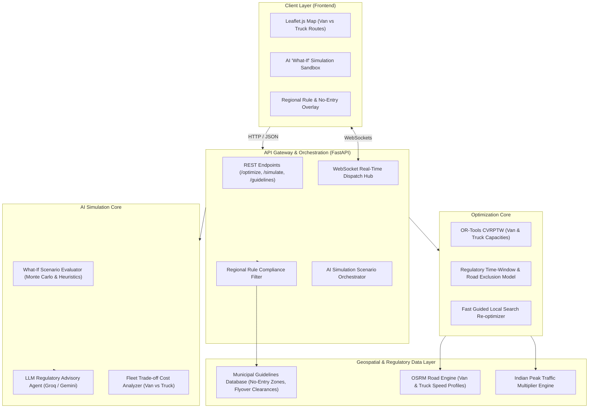

# RouteOpt: Next-Generation Route Optimization Engine
## Combined Strategic & Architectural Plan for Versions 2 & 3
### Focus: Van & Truck Freight Logistics, Regional Government Road Guidelines & AI "What-If" Scenario Simulation
**Project-Based Learning (PBL) — 5th Semester**  
**Team Members:**  
- **Member 1 (Aditya Khiratkar):** Geospatial Engineering, Regional Regulatory Geofencing & UI Simulation Sandbox  
- **Member 2 (Aditya Yadav):** Mathematical Solver (OR-Tools) with Regulatory Road Constraints & Vehicle Class Dimensions  
- **Member 3 (Sparsh):** System Architecture, AI "What-If" Simulation Engine & LLM Regulatory Advisory Agent  

---

## 1. Executive Summary & Evolution Roadmap

RouteOpt is an intelligent route planning and simulation platform tailored to commercial freight logistics (**Delivery Vans** and **Heavy/Medium Trucks**) operating under stringent Indian municipal regulations and urban road guidelines.

```
┌─────────────────────────────────┐      ┌─────────────────────────────────┐      ┌─────────────────────────────────┐
│           VERSION 1             │      │           VERSION 2             │      │           VERSION 3             │
│        (Baseline MVP)           │ ───► │ (Regulatory Fleet & Guidelines) │ ───► │(AI Simulation & "What-If" Engine)│
├─────────────────────────────────┤      ├─────────────────────────────────┤      ├─────────────────────────────────┤
│ • Single Vehicle TSP / basic    │      │ • Fleet: Commercial Vans (LCVs) │      │ • AI "What-If" Scenario Sim:    │
│   CVRP (1 Depot, up to 10 stops)│      │   and Heavy Trucks (MCV/HCV)    │      │   Predict outcomes for sudden   │
│ • Static OSRM Road Distance &   │      │ • Government Road Guidelines:   │      │   traffic bans, weather, delays │
│   Duration Matrix               │      │   - Municipal "No-Entry" windows│      │ • LLM Regulatory Advisor:       │
│ • Google OR-Tools Heuristic     │      │   - Height/Weight bridge limits │      │   Explains regional rules &     │
│ • Leaflet.js interactive pins   │      │   - Axle/GVW arterial bans      │      │   recommends fleet workarounds  │
│ • Synchronous FastAPI Gateway   │      │ • CVRPTW with Customer Windows  │      │ • Real-time DVRP Re-routing     │
│                                 │      │ • Peak-Hour Traffic Multipliers │      │ • Fleet trade-off analytics:    │
│                                 │      │ • Indian Geocoding (Nominatim)  │      │   (e.g., 2 Vans vs. 1 Big Truck)│
└─────────────────────────────────┘      └─────────────────────────────────┘      └─────────────────────────────────┘
```

### 1.1 Version 1 Retrospective (Completed Prototype)
*   Baseline multi-stop routing using Google OR-Tools `PATH_CHEAPEST_ARC`.
*   Local/mocked OSRM road graph with Leaflet interactive pin markers.
*   Basic single-driver dispatch capability.

### 1.2 Version 2: Commercial Van & Truck Fleet with Regional Government Road Guidelines
Indian metropolitan authorities (e.g., Mumbai Traffic Police / MMRDA, Pune Municipal Corporation / PMC, Delhi-NCR Transport Dept) enforce strict freight regulations:
1.  **Vehicle Classes (Commercial Freight Focus):**
    *   **Delivery Vans (LCVs):** Tata Ace ("Chhota Hathi"), Mahindra Bolero Maxi Truck, Ashok Leyland Dost. Gross Vehicle Weight (GVW) $< 3.5\text{ tonnes}$. Can access narrow lanes and enjoy relaxed city entry windows.
    *   **Freight Trucks (MCVs/HCVs):** Tata 407, Eicher Pro, BharatBenz multi-axle trucks. GVW $7.5\text{ to } 16\text{ tonnes}$. Carry heavy payloads but are heavily restricted by city regulations.
2.  **Regional Government Road Guidelines & Traffic Rules Engine:**
    *   **Municipal "No-Entry" Time Windows:** Heavy commercial trucks are legally banned from entering city zones during peak commute hours (e.g., **08:00 AM – 11:30 AM** and **05:00 PM – 09:30 PM** in Mumbai/Pune). Vans are permitted or restricted to specific arterial bypasses.
    *   **Physical Infrastructure Restrictions:** Flyover height barriers (e.g., $2.5\text{m}$ clearance prevents trucks from taking flyovers, forcing them onto surface roads), old bridge weight restrictions ($< 5\text{ tonnes}$).
    *   **Zone Classifications:** Heritage zones, residential areas, and coastal roads with strict "Heavy Vehicle Prohibited" signage.
3.  **Delivery Time Windows (CVRPTW):** Customer delivery slots aligned with legal unloading hours at retail stores and warehouses.

### 1.3 Version 3: AI-Powered "What-If" Simulation & Regulatory Advisory Engine
Version 3 introduces an intelligent digital twin simulation environment:
1.  **AI "What-If" Scenario Simulator:**
    *   Allows dispatch managers to simulate hypothetical operational situations:
        *   *Scenario 1 (Regulatory Cutoff Breach):* "What happens if Truck 1 is delayed by 45 minutes at Bhiwandi and reaches the Mumbai border at 17:15 (during the 17:00–21:30 No-Entry ban)?" $\rightarrow$ AI simulates the penalty, predicts whether the truck should park at an outer holding bay or offload onto 2 standby vans.
        *   *Scenario 2 (Fleet Swap Trade-off):* "What would happen if we replace 1 heavy 10-ton Truck with 3 Tata Ace vans?" $\rightarrow$ AI compares total fuel costs, toll charges, driver wages against the time gained by bypassing No-Entry restrictions.
        *   *Scenario 3 (Sudden Monsoon / Chokepoint Disruption):* "What happens if a major underpass is waterlogged, forcing a detour under a low-clearance bridge?" $\rightarrow$ AI calculates feasibility and automatically excludes trucks from low bridges.
2.  **LLM Regulatory Advisor (Powered by Groq / Gemini / Ollama):**
    *   Translates regional government gazette notifications into human-understandable advice:
    *   *Example Output:* *"Warning: Proposed route for Truck MH-04-AB-1234 enters Western Express Highway at 18:30, violating Mumbai Traffic Police Notification Sec 115/116. Recommended Action: Reroute via Eastern Freeway Commercial Corridor or delay entry until 21:30."*
3.  **Dynamic VRP (DVRP) with Live Re-routing:** Real-time event notifications over WebSockets when traffic police issue ad-hoc diversions or VIP route closures.

---

## 2. System Architecture & Information Flow



---

## 3. Mathematical Formulation with Regional Road Guidelines

We formulate the problem as a **Heterogeneous Commercial Fleet Vehicle Routing Problem with Regulatory Time-Space Exclusion Zones (H-VRPTW-REZ)**.

### 3.1 Objective Function
$$\min Z = \sum_{k \in K} \sum_{i \in N} \sum_{j \in N} \left( c_{ij}^k(\text{traffic}) + \text{Toll}_{ij}^k \right) \cdot x_{ij}^k + \sum_{k \in K} F_k \cdot y_k + \sum_{i \in C} P_i \cdot (1 - z_i) + \sum_{k \in K} \sum_{(i,j) \in \text{RegZone}} \Omega \cdot \text{Violation}_{ij}^k$$

Where:
*   $k \in \{\text{Van}, \text{Truck}\}$: Fleet vehicle class.
*   $c_{ij}^k$: Road travel cost based on vehicle-specific speed profiles (Trucks travel $25\text{–}35\text{ km/h}$ in urban traffic, Vans travel $35\text{–}45\text{ km/h}$).
*   $F_k$: Fixed vehicle dispatch cost ($F_{\text{Truck}} > F_{\text{Van}}$, but Truck capacity is $4\times$ larger).
*   $\text{Toll}_{ij}^k$: Commercial toll fee differences (Trucks pay higher entry/octroi tolls).
*   $\Omega$: Prohibitive penalty ($\infty$) for violating municipal no-entry laws or bridge weight/height thresholds.

### 3.2 Regional Regulatory Constraints

| Regulation Type | Mathematical Condition | Real-World Operational Rule (e.g. Mumbai/Pune) |
| :--- | :--- | :--- |
| **Municipal "No-Entry" Window** | If $k \in \text{Truck}$ and $j \in \text{UrbanZone}$, then $T_{j}^k \notin [08:00, 11:30] \cup [17:00, 21:30]$ | Heavy trucks barred from urban centers during morning/evening commute hours. Vans are exempt. |
| **Bridge / Flyover Height Limit** | If $\text{Height}_k > H_{\text{barrier}}$ (e.g. $2.5\text{m}$), then $x_{ij}^k = 0 \quad \forall (i,j) \in \text{FlyoverArcs}$ | Trucks cannot use flyovers with overhead clearance gantries; must use ground-level arterial roads. |
| **Gross Vehicle Weight (GVW)** | If $\text{GVW}_k > W_{\text{limit}}$ (e.g. $7.5\text{ tonnes}$), then $x_{ij}^k = 0 \quad \forall (i,j) \in \text{OldBridgeArcs}$ | Old heritage bridges restrict heavy multi-axle freight. |
| **Customer Delivery Windows** | $E_i \le T_i^k \le L_i$ | Commercial drop-off slots (e.g. store loading docks only open 12:00 PM – 04:00 PM). |
| **Handling & Unloading Time** | $S_i(\text{Truck}) \ge 25\text{ min}, \quad S_i(\text{Van}) \ge 10\text{ min}$ | Trucks carry palletized bulk requiring longer dock turnaround times than nimble vans. |

---

## 4. Team Work Distribution Across Versions 2 & 3

```
┌────────────────────────────────────────────────────────────────────────────────────────┐
│                              MEMBER WORK BREAKDOWN                                     │
├────────────────────────────┬────────────────────────────┬──────────────────────────────┤
│  MEMBER 1: Aditya Khiratkar │   MEMBER 2: Aditya Yadav   │      MEMBER 3: Sparsh        │
│    (Geospatial & Spatial)  │  (Optimization & Algorithms│ (Architecture, AI & Gateway) │
├────────────────────────────┼────────────────────────────┼──────────────────────────────┤
│ • Regional No-Entry        │ • OR-Tools solver with Van │ • AI "What-If" Scenario      │
│   geofence database (Mumbai│   vs. Truck vehicle classes│   Simulation Engine          │
│   & Pune municipal rules)  │ • Road restriction penalty │ • LLM Regulatory Advisor     │
│ • OSRM routing profiles:   │   matrix (height/weight/GVW│   (Groq / Gemini)            │
│   truck.lua vs car/van     │ • CVRPTW with unloading    │ • FastAPI Scenario API &     │
│ • Leaflet UI: Van & Truck  │   dwell times by vehicle   │   Pydantic contracts         │
│   color overlays & bans    │ • Fleet swap trade-off     │ • WebSocket real-time alerts │
│ • Height barrier layer     │   benchmarking (1 Truck vs │ • Docker orchestration &     │
│   on interactive map       │   multiple Vans)           │   Redis scenario cache       │
└────────────────────────────┴────────────────────────────┴──────────────────────────────┘
```

---

## 5. Required External APIs & Services Matrix

| Service / Capability | Recommended Provider | Free Tier / Pricing | API Key? | College Demo Fallback Strategy |
| :--- | :--- | :---: | :---: | :--- |
| **Road Matrix & Routing** | **OSRM (Self-Hosted)** | **100% Free** | **No** | Local Docker container. Uses custom road penalty tags for truck vs. van routes. |
| **Regional Guidelines Data** | **Embedded Regulatory JSON** (Mumbai MMRDA / Pune PMC) | **100% Free** | **No** | Pre-configured database of municipal no-entry hours, flyover height gantries, and toll limits. Zero external dependency. |
| **AI "What-If" Simulator & Advisor** | **Groq API (Llama 3.3 70B)** *(Primary)*<br>Google Gemini 2.0 Flash *(Secondary)* | **Free Tier** (Generous RPM)<br>Free Tier | **Yes** (Free) | Built-in Rule-Based Heuristic Advisor provides structured violation warnings if offline. |
| **Geocoding & Search** | **OSM Nominatim** | **100% Free** | **No** | Free public geocoder + pre-mapped logistics hubs (Bhiwandi, Kalamboli, Navi Mumbai, Pune MIDC). |
| **Peak Traffic Multiplier** | **Temporal Congestion Model** | **100% Free** | **No** | Empirical rush-hour model ($1.65\times$ morning, $1.85\times$ evening delays). |
| **Map UI Rendering** | **Leaflet.js + OSM Tiles** | **100% Free** | **No** | Standard open-source web stack. |

> [!TIP]
> **Key Strength for Tomorrow's Evaluation:**  
> Evaluators appreciate practical alignment with Indian ground realities. Explaining how RouteOpt prevents a ₹20,000 traffic police fine by enforcing **Municipal No-Entry Windows** and simulating **"What happens if our truck gets delayed at the octroi checkpoint"** using AI sets this project far ahead of generic TSP toys!

---

## 6. Sprint Roadmap & Deliverables

1.  **Phase 1 (v2 Core Fleet & Guidelines):**
    *   Formulate Van (Tata Ace) and Truck (Tata 407/BharatBenz) models in OR-Tools with distinct speed, payload, and cost attributes.
    *   Encode Mumbai/Pune municipal no-entry time windows and bridge restriction rules.
2.  **Phase 2 (v2 Integration & UI):**
    *   Build OSRM routing profile with truck exclusions.
    *   Create Leaflet map showing vehicle-specific paths (e.g., green path for Van through city alleys, orange highway path for Truck).
3.  **Phase 3 (v3 AI "What-If" Simulation):**
    *   Implement AI Simulation Controller: Run parallel perturbation simulations (delays, road closures, fleet swap).
    *   Connect LLM Regulatory Advisor to synthesize natural-language risk analysis and legal compliance summaries.
4.  **Phase 4 (v3 Benchmarking & Stress Testing):**
    *   Quantify trade-offs: Cost and transit time comparison between 1 Large Truck vs. 3 Small Vans under peak no-entry constraints.

---

## 7. Performance Benchmarks & Success Criteria

| Metric | Version 1 Baseline | Version 2 (Van & Truck Guidelines) | Version 3 (AI What-If Simulation) |
| :--- | :---: | :---: | :---: |
| **Fleet Types Supported** | Generic 1 Vehicle | Van (LCV) & Truck (HCV) | Heterogeneous Mixed Fleet |
| **Municipal Rule Compliance** | None (Violations possible) | 100% No-Entry Window Adherence | Proactive Delay Warning & Diversion |
| **Bridge/Flyover Restrictions** | Not considered | Height & GVW road exclusions | Dynamic detour calculation |
| **AI "What-If" Simulation Time** | N/A | N/A | < 1.5 seconds per scenario |
| **Fleet Trade-off Analysis** | N/A | Manual calculation | Automated (Cost vs Delay comparison) |
| **Solve Time (25 stops)** | N/A | < 450 ms | < 800 ms with simulation branches |
